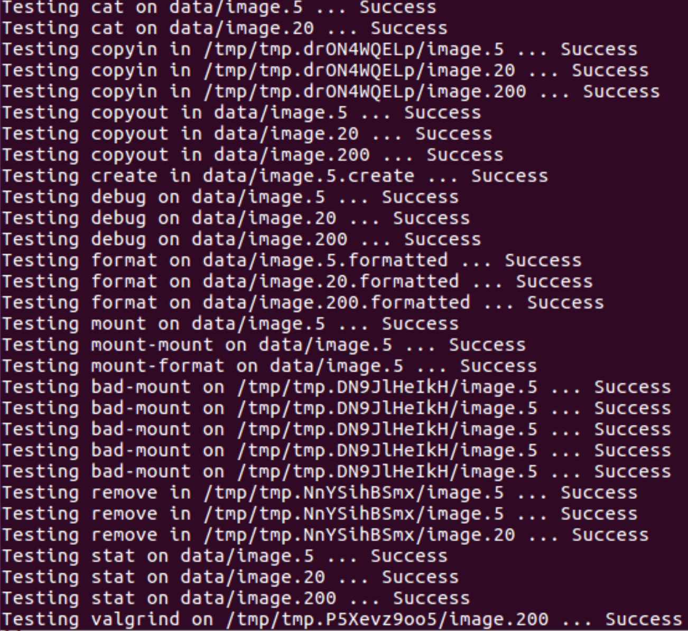

# 操作系统Ⅰ·Project2·实验报告

> 18302010017
>
> 姚鸿韬


## 运行截图



在code目录下执行make test，得到截图如上所示，所有测试全部通过。


## 具体实现说明

### debug

```c++
// 省略输出部分
void FileSystem::debug(Disk *disk) {
    Block block{};
    // Read superblock
    disk->read(0, block.Data);
    // 验证魔数正确性
    if (block.Super.MagicNumber == MAGIC_NUMBER) { /***/ }
    else return;
    // inode编号
    uint32_t n = -1;
    // Read Inode blocks
    uint32_t num_inode_blocks = block.Super.InodeBlocks;
    for (uint32_t i = 1; i <= num_inode_blocks; i++) {
        disk->read(i, block.Data); // array of inodes
        for (auto &Inode : block.Inodes) { // 遍历block中的所有可能inode
            n++;
            if (!Inode.Valid) continue;
            // 处理直接索引块
            for (uint32_t k : Inode.Direct) if (k) printf(" %u", k);
            // 处理间接索引块
            if (!Inode.Indirect) continue;
            // 读入间接索引块内容
            Block IndirectBlock{};
            disk->read(Inode.Indirect, IndirectBlock.Data);
            // 遍历所有可能的间接索引块
            for (uint32_t Pointer : IndirectBlock.Pointers) if (Pointer) printf(" %u", Pointer);
        }
    }
}
```

debug的核心是理解Super Block与Inode Block的结构，整个函数也只和这两种块有关。

首先通过disk->read(0)获取Super Block信息，并从block.Super中获取元数据，如魔数签名、Inode Block、总Block个数等；

接着由于无法事先确定Inode Block中是否有已启用的Inode，因此要对每个Inode Block进行遍历。访问其中的每个Inode，判断其Valid属性，如果为真则分别处理其中的直接索引块与间接索引块：处理方法类似，都是通过遍历每个可能的索引块，判断其是否指向非0的块号（块号为0则不可用）；

最终将需要的数据输出即可。

### format

```c++
bool FileSystem::format(Disk *disk) {
    // 若已挂载则不处理
    if (disk->mounted()) return false;
    // Write superblock
    Block block{};
    memset(&block, 0, sizeof(Block));
    block.Super.MagicNumber = FileSystem::MAGIC_NUMBER;
    block.Super.Blocks = (uint32_t) (disk->size());
    // 分配给inode的block数，十分之一向上取整
    block.Super.InodeBlocks = (uint32_t) std::ceil((block.Super.Blocks * 1.00) / 10);
    block.Super.Inodes = block.Super.InodeBlocks * (FileSystem::INODES_PER_BLOCK);
    disk->write(0, block.Data);
    // Clear all other blocks
    for (uint32_t i = 1; i < block.Super.Blocks; i++) {
        Block Empty_block{};
        memset(&Empty_block, 0, sizeof(Empty_block));
        disk->write(i, Empty_block.Data);
    }
    return true;
}
```

format用于初始化磁盘格式，即经过format后disk的Super Block会根据要求设置字段，而其余Block全部置位为0。

实现比较简单，首先注意判断磁盘是否已挂载，若已挂载则不予处理（下面所有的函数都需要进行挂载的判断，不再赘述）；

接下来先对Super Block进行格式化，注意block.Super.Blocks保存的是总共的块数，可以直接使用disk->size()，因为这个函数返回的是以块数形式出现的磁盘大小；block.Super.InodeBlocks保存的是Inode块的数量，根据文档要求使用总块数的十分之一并向上取整；

最后将所有其他的块全部清0，然后写回磁盘即可。

### mount

```c++
bool FileSystem::mount(Disk *disk) {
    if (disk->mounted()) return false;
    Block block{};
    disk->read(0, block.Data);
    if (block.Super.MagicNumber != MAGIC_NUMBER) return false;
    if (block.Super.InodeBlocks != std::ceil((block.Super.Blocks * 1.00) / 10)) return false;
    if (block.Super.Inodes != (block.Super.InodeBlocks * INODES_PER_BLOCK)) return false;
    // Set device and mount
    disk->mount();
    cur_disk = disk;
    // Copy metadata
    MetaData = block.Super;
    // Allocate free block bitmap
    free_block_bitmap.resize(MetaData.Blocks, false);
    free_block_bitmap[0] = true;
    inode_counter.resize(MetaData.InodeBlocks, 0);
    // 遍历所有inode，找寻其中已经使用的block
    for (uint32_t i = 1; i <= MetaData.InodeBlocks; i++) {
        disk->read(i, block.Data);
        // 遍历所有可能的inode节点
        for (auto &Inode : block.Inodes) {
            if (!Inode.Valid) continue;
            inode_counter[i - 1]++;
            free_block_bitmap[i] = true;
            // 遍历所有可能的直接索引块，找已使用了的
            for (uint32_t k : Inode.Direct) {
                if (!k)  continue;
                if (k >= MetaData.Blocks) return false; // 防溢出
                // 本直接索引块已使用
                free_block_bitmap[k] = true;
            }            
            // 处理间接索引
            if (!Inode.Indirect) continue;
            if (Inode.Indirect >= MetaData.Blocks) return false; // 防溢出
            // 间接索引块已使用
            free_block_bitmap[Inode.Indirect] = true;
            Block indirect{};
            cur_disk->read(Inode.Indirect, indirect.Data);
            for (uint32_t Pointer : indirect.Pointers) {
                if (Pointer >= MetaData.Blocks) return false; // 防溢出
                // 间接索引块指向的目标已使用
                free_block_bitmap[Pointer] = true;
            }
        }
    }
    return true;
}
```

mount用于挂载磁盘。挂载操作主要用于将目标磁盘的信息读入程序（内存）中，包括Super Block中的元数据以及每个块的使用情况（Free Block Bitmap）。

实现中，首先读入Super Block并进行检验，然后设置数个成员变量，如cur_disk指向当前挂载的磁盘，free_block_bitmap指向空闲块队列，inode_counter代表每个Inode Block中已使用的Inode数量等；

由于磁盘文件本身不带有任何有关块使用情况的信息，因此还是必须遍历所有的Inode Block以确定每个直接索引块及间接索引块的使用情况。其余的操作与debug类似，区别只有1.在遍历过程中检验到使用过的块后需要相应置位free_block_bitmap及inode_counter；2.需要检查下标防止溢出后程序崩溃。

### create

```c++
ssize_t FileSystem::create() {
    if (!cur_disk || !cur_disk->mounted()) return -1;
    Block block{};
    cur_disk->read(0, block.Data);
    // Locate free inode in inode table
    for (uint32_t i = 1; i <= MetaData.InodeBlocks; i++) {
        // 这个inode块中是否存在未分配inode
        if (inode_counter[i - 1] == INODES_PER_BLOCK) continue;
        cur_disk->read(i, block.Data);
        // 遍历找到第一个
        for (uint32_t j = 0; j < INODES_PER_BLOCK; j++) {
            if (block.Inodes[j].Valid) continue;
            block.Inodes[j].Valid = true;
            block.Inodes[j].Size = 0;
            block.Inodes[j].Indirect = 0;
            for (uint32_t &k : block.Inodes[j].Direct) k = 0;
            free_block_bitmap[i] = true;
            inode_counter[i - 1]++;
            // 将更新后的数据写回磁盘
            cur_disk->write(i, block.Data);
            // Record inode if found
            return (((i - 1) * INODES_PER_BLOCK) + j);
        }
    }
    return -1;
}
```

create用于创建一个新的Inode。在本实现中是找到第一个可用的位置创建Inode。

具体而言，首先遍历inode_counter（在mount中初始化的），找到第一个非满的Inode Block，然后遍历这个Inode Block，找到第一个未使用（Valid为否）的Inode，并初始化它（同format）；

最后注意置位free_block_bitmap与inode_counter，然后写回磁盘，返回Inode号即可。

### 辅助函数load_inode

```c++
bool FileSystem::load_inode(size_t inumber, Inode *inode) {
    if (!cur_disk || !cur_disk->mounted()) return false;
    Block block{};
    // 在第i+1块inode块的第j个位置
    int i = (int) (inumber / INODES_PER_BLOCK);
    int j = (int) (inumber % INODES_PER_BLOCK);
    // 载入对应位置的inode
    if (inode_counter[i]) {
        cur_disk->read(i + 1, block.Data);
        if (block.Inodes[j].Valid) {
            *inode = block.Inodes[j];
            return true;
        }
    }
    return false;
}
```

load_inode是新实现的辅助函数，用于从磁盘载入指定inumber的Inode。若Inode可用，则将其载入*inode中，否则返回false。

实现也很简单，主要是确定指定inumber在Inode Block中的位置，应该在第i+1个Inode Block中的第j个位置（i，j含义如程序所示）（i+1是因为第0块是Super Block）；接着只要判断并载入即可。

### remove

```c++
bool FileSystem::remove(size_t inumber) {
    if (!cur_disk || !cur_disk->mounted()) return -1;
    Block block{};
    Inode inode{};
    if (!load_inode(inumber, &inode)) return false;
    inode.Valid = false;
    inode.Size = 0;
    int i = (int) (inumber / INODES_PER_BLOCK);
    int j = (int) (inumber % INODES_PER_BLOCK);
    // 如果这个inode是本块中最后一个inode，则将块状态修改为未使用
    if (--inode_counter[i] == 0) free_block_bitmap[i + 1] = false;
    // Free direct blocks
    for (uint32_t &k : inode.Direct) {
        free_block_bitmap[k] = false;
        k = 0;
    }
    // Free indirect blocks
    if (inode.Indirect) {
        cur_disk->read(inode.Indirect, block.Data);
        free_block_bitmap[inode.Indirect] = false;
        inode.Indirect = 0;
        for (uint32_t Pointer : block.Pointers) if (Pointer) free_block_bitmap[Pointer] = false;
    }
    // Clear inode in inode table
    cur_disk->read(i + 1, block.Data);
    block.Inodes[j] = inode;
    cur_disk->write(i + 1, block.Data);
    return true;
}
```

remove用于移除一个Inode。

具体实现中，先使用刚才提到的load_inode检验该Inode是否当前可用，然后开始初始化这个Inode。对每个直接索引块与间接索引块同样遍历，然后清空，同时注意要重置free_block_bitmap与inode_counter；最后将Inode写回disk即可。

### stat

```c++
ssize_t FileSystem::stat(size_t inumber) {
    if (!cur_disk || !cur_disk->mounted()) return -1;
    // Load inode information
    Inode inode{};
    if (load_inode(inumber, &inode)) return inode.Size;
    return -1;
}
```

stat用于返回一个Inode的大小，若其不可用则返回-1。

实现非常简单，只需要调用之前的load_inode获取指定Inode信息，然后返回inode.Size即可。

### 辅助函数read_in_block

```c++
void FileSystem::read_in_block(uint32_t blocknum, int offset, int *length, char **ptr) {
    Block block{};
    cur_disk->read(blocknum, block.Data);
    // 读取到的字节数
    uint32_t num_bytes = Disk::BLOCK_SIZE - offset;
    memcpy(*ptr, block.Data + offset, num_bytes);
    *ptr += num_bytes;
    *length -= num_bytes;
}
```

read_in_block是新实现的辅助函数，用于读取一整块的内容，并从offest偏移量开始复制到\*ptr中。这个函数只为read服务。

num_bytes是读取到的字节数（Block总字节数-偏移量）。然后将\*ptr指针后移num_bytes，length需要读取的长度减去num_bytes。

### read

```c++
ssize_t FileSystem::read(size_t inumber, char *data, int length, size_t offset) {
    if (!cur_disk || !cur_disk->mounted()) return -1;
    // Load inode information
    ssize_t size_inode = stat(inumber);
    if ((int) offset >= size_inode) return 0;
    else if (length + (int) offset > size_inode) length = size_inode - (int) offset; // Adjust length
    Inode inode{};
    if (!load_inode(inumber, &inode)) return -1;
    // 下一数据保存位置
    char *ptr = data;
    // 总共需要读取的字节数
    size_t num_bytes = length;
    // Read block and copy to data
    // 起始位置在直接索引
    if (offset < POINTERS_PER_INODE * Disk::BLOCK_SIZE) {
        uint32_t direct_node = offset / Disk::BLOCK_SIZE;
        offset %= Disk::BLOCK_SIZE;
        if (!inode.Direct[direct_node]) return 0; // 无存储数据
        read_in_block(inode.Direct[direct_node], offset, &length, &ptr);
        direct_node++;
        while (length > 0 && direct_node < POINTERS_PER_INODE && inode.Direct[direct_node])
            read_in_block(inode.Direct[direct_node++], 0, &length, &ptr);
        if (length <= 0) return num_bytes; // 已读取足够数据
        // 读完了直接索引或没有间接索引
        if (direct_node != POINTERS_PER_INODE || !inode.Indirect) return num_bytes - length;
        // 读取间接索引中的剩余部分
        Block indirect{};
        cur_disk->read(inode.Indirect, indirect.Data);
        for (uint32_t &Pointer : indirect.Pointers) {
            if (!Pointer || length <= 0) break;
            read_in_block(Pointer, 0, &length, &ptr);
        }
        if (length <= 0) return num_bytes; // 已读取足够数据
        // 间接索引也读完了
        return num_bytes - length;
    } else {
        // 起始位置在间接索引中
        if (!inode.Indirect) return 0;
        // 去掉直接索引的偏移量部分
        offset -= POINTERS_PER_INODE * Disk::BLOCK_SIZE;
        // 间接索引块下标
        uint32_t indirect_node = offset / Disk::BLOCK_SIZE;
        offset %= Disk::BLOCK_SIZE;
        Block indirect{};
        cur_disk->read(inode.Indirect, indirect.Data);
        // 第一块间接索引，从偏移量开始读
        if (indirect.Pointers[indirect_node] && length > 0) 
            read_in_block(indirect.Pointers[indirect_node++], offset, &length, &ptr);
		// ...同上读取后续间接索引块
    }
}
```

read用于从指定inumber的Inode将从offset开始的length字节读入\*data中，若length超过了Inode持有的总数据量，则可能读取到少于length的数据。

实现中，首先根据stat(inumber)获取到的Inode大小调整一次length，然后分情况处：

1. 偏移量落在直接索引区域。

​	首先计算得到包含首字节的直接索引块下标，以及首字节在这个块中的偏移量（仍存在offset中）；

​	然后尝试用之前的read_in_block辅助函数对直接索引块进行连续读取，注意只有第一次传参的偏移量为offset，其余都为0，每次的块	号都递增1，直到已读取到足够的数据（length<=0）或直接索引块内已没有足够的数据；

​	接下来进行判断，如果已读取到足够的数据或者整个Inode的数据都被读取完成了，则直接返回，否则说明剩余部分在间接索引块中，	要继续读取。

2. 偏移量落在间接索引区域。

​	首先计算间接索引块下标。注意先减去所有直接索引块能容纳的字节数；

​	接下来的部分可以和1进行共用，区别只是在于在1的后续部分中indirect_node与offset都为0，而在2中不一定。

​	读取间接索引块与直接索引块很类似，区别只是在于对每个间接索引块不是直接读取，而是对indirect.Pointers（真实数据块）进行遍	历，其余都一样，每次循环都要判断终止条件（已足够或已读完）。

最后返回读取到的字节数就可以，因为数据已经在\*data中了。

### 辅助函数allocate_block/write_inode_to_block/write_data_to_block

最后三个辅助函数都是只为write服务的。

```c++
bool FileSystem::allocate_block(uint32_t &blocknum) {
    if (!cur_disk || !cur_disk->mounted()) return -1;
    if (blocknum) return true;
    for (int i = (int) MetaData.InodeBlocks + 1; i < (int) MetaData.Blocks; i++) 
        if (!free_block_bitmap[i]) {
            free_block_bitmap[i] = true;
            blocknum = i;
            return true;
        }
    return false;
}
```

allocate_block用于分配一个未使用的块，用于存放真实数据。

实现非常简单，对除Super Block与Inode Block以外的块进行遍历，找到第一个在free_block_bitmap中为否的块，将其赋值给blocknum，返回即可。

若blocknum初始不为0，说明不需要分配，直接返回true；若遍历完成都没有找到空闲块，说明磁盘满了，返回false。

```c++
void FileSystem::write_inode_to_block(size_t inumber, Inode *inode) {
    if (!cur_disk || !cur_disk->mounted()) return;
    // 在第i+1块inode块的第j个位置
    int i = (int) (inumber / INODES_PER_BLOCK);
    int j = (int) (inumber % INODES_PER_BLOCK);
    Block block{};
    cur_disk->read(i + 1, block.Data);
    block.Inodes[j] = *inode;
    cur_disk->write(i + 1, block.Data);
}
```

write_inode_to_block顾名思义用于将更新过的Inode信息写入它对应的Inode块中。

实现前面基本已经提过，先确定其所处位置，如通过读-改-写完成磁盘数据的更新。

```c++
void FileSystem::write_data_to_block(int offset, int *num_bytes, int length, char *data, uint32_t blocknum){
    if (!cur_disk || !cur_disk->mounted()) return;
    // 缓冲区用于先存储整个块大小的数据
    char *ptr = (char *) calloc(Disk::BLOCK_SIZE, sizeof(char));
    cur_disk->read(blocknum, ptr);
    // 从偏移量开始逐字节修改数据
    for (int i = offset; i < (int) Disk::BLOCK_SIZE && *num_bytes < length; i++) {
        ptr[i] = data[*num_bytes];
        *num_bytes = *num_bytes + 1;
    }
    cur_disk->write(blocknum, ptr);
    free(ptr); // 释放缓冲区
}
```

write_data_to_block顾名思义用于将真实数据写入磁盘块中。

首先用calloc开一个大小等于BLOCK_SIZE的缓冲区，然后将目标block中原有的数据读入缓冲区（防止偏移量之前的部分丢失）；

接着从偏移量开始逐字节进行覆盖，直到到了块底或长度耗尽；

最后将缓冲区写回磁盘。（其实也是读-改-写的过程）

### write

```c++
ssize_t FileSystem::write(size_t inumber, char *data, int length, size_t offset) {
    if (!cur_disk || !cur_disk->mounted()) return -1;
    Inode inode{};
    Block indirect{};
    int num_bytes = 0;
    size_t old_offset = offset;
    size_t old_size = 0;
    int max_size = length + (int) offset;
    // 超过最大可能长度
    if (max_size > (int) ((POINTERS_PER_BLOCK + POINTERS_PER_INODE) * Disk::BLOCK_SIZE)) return -1;
    if (!load_inode(inumber, &inode)) {
        inode.Valid = true;
        inode.Size = max_size;
        for (uint32_t &i : inode.Direct) i = 0;
        inode.Indirect = 0;
        inode_counter[inumber / INODES_PER_BLOCK]++;
        free_block_bitmap[inumber / INODES_PER_BLOCK + 1] = true;
    } else {
        old_size = inode.Size;
        inode.Size = fmax((int) inode.Size, max_size); // 重设inode大小
    }
    // 从直接索引开始写
    if (offset < POINTERS_PER_INODE * Disk::BLOCK_SIZE) {
        // 直接索引块下标
        uint32_t direct_node = offset / Disk::BLOCK_SIZE;
        offset %= Disk::BLOCK_SIZE;
        // 尝试为直接索引分配块，若磁盘已满则直接返回，下同
        if (!allocate_block(inode.Direct[direct_node])) {
            inode.Size = old_size;
            write_inode_to_block(inumber, &inode);
            return num_bytes;
        }
        // 真实写入数据
        write_data_to_block(offset, &num_bytes, length, data, inode.Direct[direct_node++]);
        if (num_bytes == length) { // 写入了足够数据
            write_inode_to_block(inumber, &inode);
            return length;
        }
        for (int i = direct_node; i < (int) POINTERS_PER_INODE; i++) {
            // 之后的直接索引从0开始写
            if (!allocate_block(inode.Direct[direct_node])) {
                inode.Size = old_offset + num_bytes;
                write_inode_to_block(inumber, &inode);
                return num_bytes;
            }
            write_data_to_block(0, &num_bytes, length, data, inode.Direct[direct_node++]);
            if (num_bytes == length) { // 写入了足够数据
                write_inode_to_block(inumber, &inode);
                return length;
            }
        }
        // 开始使用间接索引块
        if (inode.Indirect) cur_disk->read(inode.Indirect, indirect.Data);
        else {
            // 目前没有间接索引块，尝试分配
            if (!allocate_block(inode.Indirect)) {
                inode.Size = old_offset + num_bytes;
                write_inode_to_block(inumber, &inode);
                return num_bytes;
            }
            cur_disk->read(inode.Indirect, indirect.Data);
            for (uint32_t &Pointer : indirect.Pointers) Pointer = 0; // 新创建的间接索引块，先全部置0
        }
        for (uint32_t &Pointer : indirect.Pointers) {
            // 尝试分配间接索引块指向的数据块
            if (!allocate_block(Pointer)) {
                inode.Size = old_offset + num_bytes;
                cur_disk->write(inode.Indirect, indirect.Data);
                write_inode_to_block(inumber, &inode);
                return num_bytes;
            }
            write_data_to_block(0, &num_bytes, length, data, Pointer);
            if (num_bytes == length) { // 写入了足够数据
                cur_disk->write(inode.Indirect, indirect.Data);
                write_inode_to_block(inumber, &inode);
                return length;
            }
        }
        cur_disk->write(inode.Indirect, indirect.Data);
        write_inode_to_block(inumber, &inode);
        return num_bytes;
    } else { // 从间接索引开始写
        // 先去掉直接索引块的偏移量部分
        offset -= POINTERS_PER_INODE * Disk::BLOCK_SIZE;
        // 计算间接索引块下标
        uint32_t indirect_node = offset / Disk::BLOCK_SIZE;
        offset %= Disk::BLOCK_SIZE;
        // ...基本同上
    }
}
```

write用于向磁盘指定inumber的Inode写入数据，从第offset字节开始共写入length字节，数据存放在\*data中。

实现中，首先要调整Inode的大小。注意这里的调整只是暂时的，因为不确定是否所有的数据都能被写入，可能会再次调整。接着跟read一样分情况讨论：

1. offset落在直接索引区域。

​	首先计算得到包含首字节的直接索引块下标，以及首字节在这个块中的偏移量（仍存在offset中）；

​	然后尝试开始从这个块开始写直接索引。写的流程如下：

​		(1) 先尝试调用allocate_block以分配数据块。注意如果已分配数据块根据allocate_block的实现会直接返回true；如果分配失败则重		设Inode大小，调用write_inode_to_block写回更新后的Inode然后返回；

​		(2) 分配成功后调用write_data_to_block写入真实数据，同时更新已写入的字节数；

​		(3) 写入完毕后进行判断，如果已写入足够数据(length==0)则同样写回磁盘，否则开始准备写间接索引；

​	2.offset落在间接索引区域。

​	首先计算间接索引块下标。注意先减去所有直接索引块能容纳的字节数；

​	接下来的部分可以和1进行共用，区别只是在于在1的后续部分中indirect_node与offset都为0，而在2中不一定。

​	写入间接索引块与直接索引块很类似，区别只是在于对每个间接索引块不是直接写入，而是对indirect.Pointers（真实数据块）进行遍	历，其余都一样，每次循环都要判断终止条件（已足够或容量已不够）。

此外，写入与读取最大的区别就在于每次写入前都要尝试分配块，因为允许都尚不存在的块进行写，如果分配失败就直接返回，提前返回都必须重新调整Inode的大小，每次返回都需要更新Inode至磁盘。


## 问题与解决

### 执行make test失败

起初尝试在code目录下执行make test时，报出"/bin/sh:1:test_*.sh not found"的错误，始终无法解决，只能通过执行./bin/sfssh调用磁盘文件，然后手动一步一步执行test脚本文件的命令并比对输出来调试。

解决：最后我尝试不通过make，而是直接在tests目录下运行test脚本，发现报错变成了无法识别/bin/bash^M，搜索得知是Windows系统与ubuntu系统的换行符不同导致的，最后对tests下的所有文件执行dos2unix将其转换为ubuntu系统格式，再次make test即可成功。

### debug时而正常时而出错

在make test调试的过程中，发现test_debug的执行成功，但是有些其他test中也用到debug，在执行到debug时就可能出错。

解决：最后通过比对read与write次数发现debug一步中的read数量远小于test中的output，然后发现debug中有时循环只执行一次。

最后发现问题出在这一步

```c++
for (uint32_t i = 1; i <= block.Super.InodeBlocks; i++) {
        disk->read(i, block.Data);
```

循环终止条件中使用了block.Super.InodeBlocks，但在循环中重新将新的块的数据读入了block，导致循环出现不可预估的情况，因此出现有时正常有时不正常的情况。将其修改为在循环外先记录block.Super.InodeBlocks的值到一个局部变量即可。